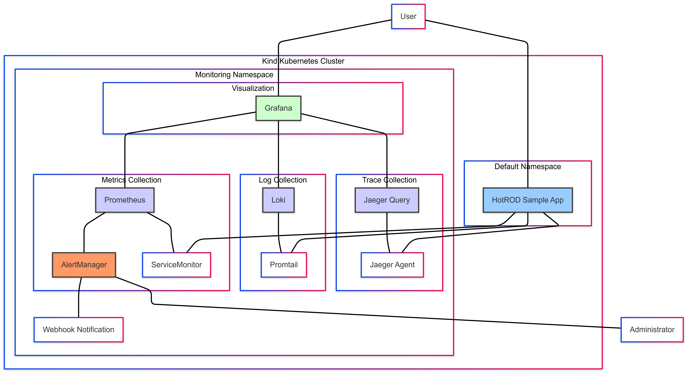
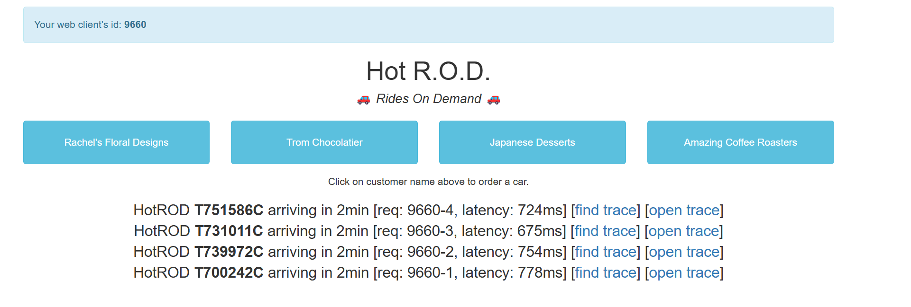
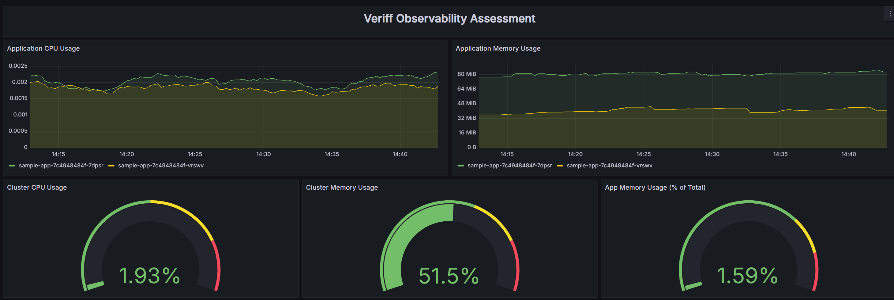
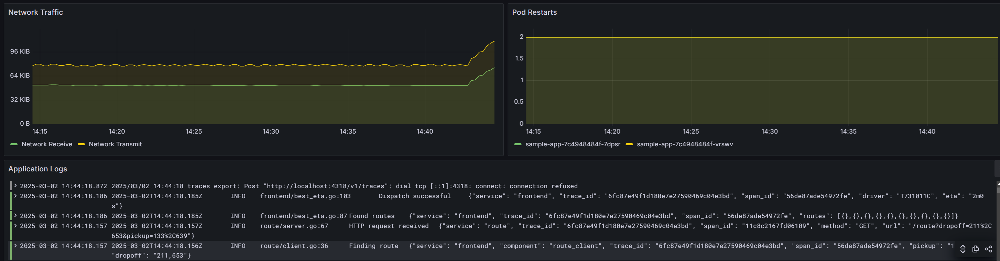
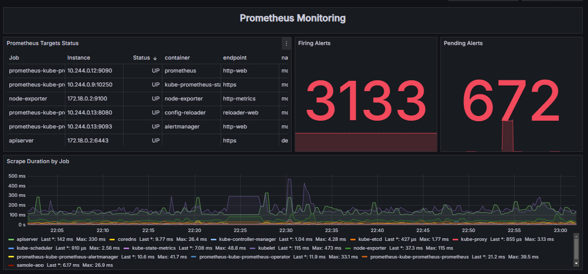
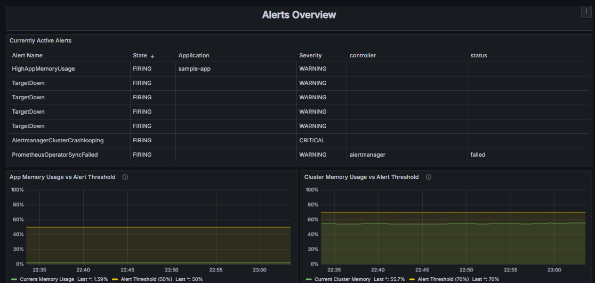
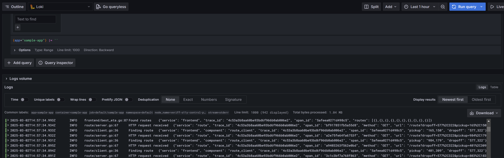
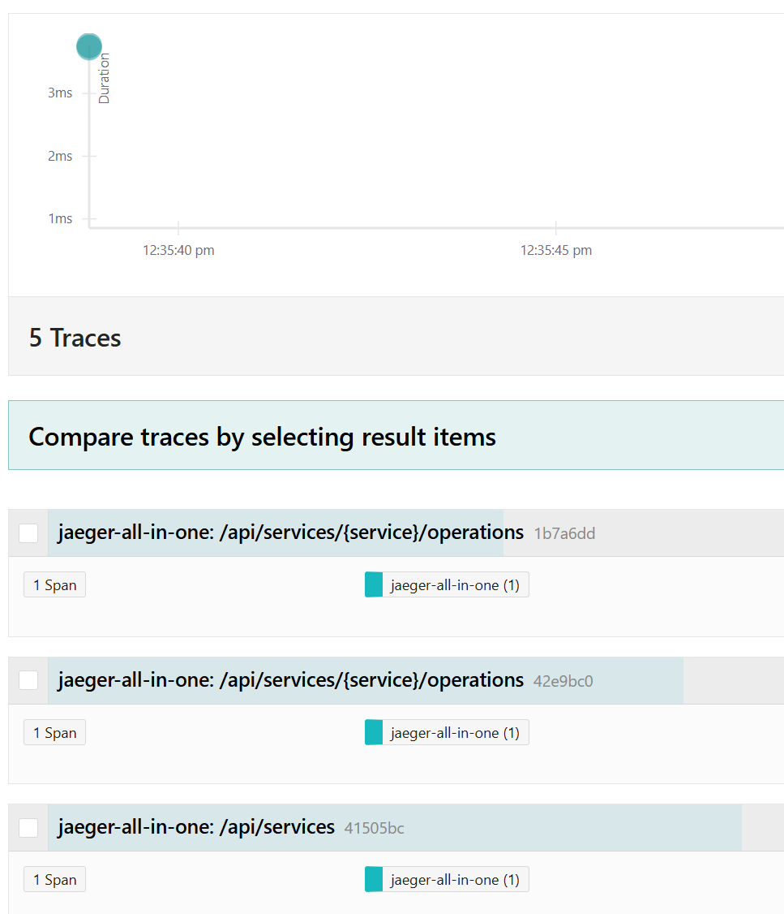
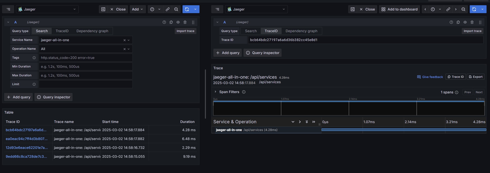
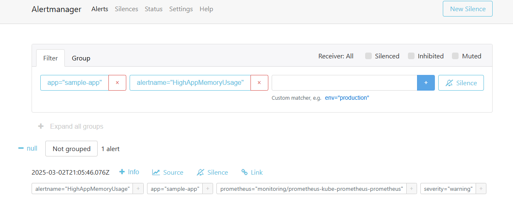

# Veriff Observability (O11Y) Assessment

## Table of Contents
- [Overview](#overview)
- [Architecture](#architecture)
- [Observability Stack Justification](#observability-stack-justification)
- [Components](#components)
- [Setup Instructions](#setup-instructions)
- [Alert Configuration](#alert-configuration)
- [Demonstration and Screenshots](#demonstration-and-screenshots)
- [Conclusion](#conclusion)

## Overview

This project demonstrates a comprehensive observability solution that collects, stores, and visualizes telemetry data from a Kubernetes environment. The implementation follows the three pillars of observability: metrics, logs, and traces, providing a complete monitoring solution for containerized applications.

## Architecture



The solution architecture follows a layered approach:

1. **Infrastructure Layer**: Kind Kubernetes cluster running in WSL
2. **Telemetry Collection Layer**:
   - Prometheus for metrics collection
   - Loki with Promtail for log aggregation
   - Jaeger for distributed tracing
3. **Visualization Layer**: Grafana for unified visualization
4. **Alerting Layer**: AlertManager for notifications and alert management
5. **Application Layer**: Sample HotROD application that emits all three types of telemetry

Data flows from the application through the collection agents to storage systems and is visualized in Grafana dashboards.

## Observability Stack Justification

### Why This Stack?

1. **Prometheus + AlertManager**:
   - Industry-standard metrics solution built for Kubernetes
   - Pull-based model works well with ephemeral containers
   - Rich query language allows flexible metric analysis
   - AlertManager provides robust alert routing capabilities
   - Extensive community support and integration options

2. **Loki + Promtail**:
   - Designed specifically for Kubernetes environments
   - Uses the same label-based approach as Prometheus, providing consistency
   - Efficient storage model with separation of metadata and log content
   - Straightforward integration with Grafana and Prometheus ecosystem

3. **Jaeger**:
   - Native support for distributed tracing with OpenTracing compatibility
   - Optimized for Kubernetes deployments
   - Provides service dependency analysis
   - Works well with the HotROD demo application

4. **Grafana**:
   - Unified visualization of all three observability pillars
   - Rich plugin ecosystem and dashboard creation capabilities
   - Support for alerts based on metrics
   - Seamless integration with Prometheus, Loki, and Jaeger

5. **HotROD Demo Application**:
   - Pre-instrumented to emit metrics, logs, and traces
   - Demonstrates a realistic microservices architecture
   - Created by the Jaeger team, ensuring proper tracing implementation
   - Provides meaningful telemetry data for dashboard visualization

This stack represents a comprehensive, cloud-native observability solution that can scale from development environments to production deployments, making it ideal for the assessment requirements.

## Components

### Kubernetes Cluster
- **Kind**: Local Kubernetes cluster running in Windows Subsystem for Linux (WSL)

### Metrics Stack
- **Prometheus**: Time-series database for collecting and storing metrics
- **kube-state-metrics**: Generates metrics about Kubernetes objects
- **AlertManager**: Handles alerts and routes notifications

### Logging Stack
- **Loki**: Log aggregation system designed for Kubernetes
- **Promtail**: Agent that ships logs to Loki

### Tracing Stack
- **Jaeger**: End-to-end distributed tracing system
- **Jaeger Agent**: Receives spans and forwards to collectors

### Visualization
- **Grafana**: Unified visualization platform for metrics, logs, and traces

### Sample Application
- **Jaeger HotROD**: Demo application that simulates a ride-sharing service with multiple microservices, instrumented to emit metrics, logs, and traces

## Setup Instructions

### 1. Prerequisites
- Docker installed
- Kind installed
- kubectl installed
- Helm installed
- WSL (Windows Subsystem for Linux) if running on Windows

### 2. Create Kind Cluster
```bash
kind create cluster --name veriff-o11y
```

### 3. Add Helm Repositories
```bash
helm repo add prometheus-community https://prometheus-community.github.io/helm-charts
helm repo add grafana https://grafana.github.io/helm-charts
helm repo add jaegertracing https://jaegertracing.github.io/helm-charts
helm repo update
```

### 4. Create Monitoring Namespace
```bash
kubectl create namespace monitoring
```

### 5. Deploy Prometheus Stack
```bash
helm install prometheus prometheus-community/kube-prometheus-stack \
  --namespace monitoring \
  --set grafana.enabled=false \
  --set prometheus.prometheusSpec.serviceMonitorSelectorNilUsesHelmValues=false \
  --set prometheus.prometheusSpec.podMonitorSelectorNilUsesHelmValues=false
```

### 6. Deploy Loki for Log Collection
```bash
helm install loki grafana/loki-stack \
  --namespace monitoring \
  --set promtail.enabled=true \
  --set loki.persistence.enabled=true \
  --set loki.persistence.size=10Gi
```

### 7. Deploy Jaeger for Tracing
```bash
helm install jaeger jaegertracing/jaeger \
  --namespace monitoring \
  --set provisionDataStore.cassandra=false \
  --set allInOne.enabled=true \
  --set storage.type=memory
```

### 8. Deploy Grafana
Create a values file for Grafana:

```bash
datasources:
  datasources.yaml:
    apiVersion: 1
    datasources:
    - name: Prometheus
      type: prometheus
      url: http://prometheus-kube-prometheus-prometheus.monitoring:9090
      access: proxy
      isDefault: true
    - name: Loki
      type: loki
      url: http://loki.monitoring:3100
      access: proxy
    - name: Jaeger
      type: jaeger
      url: http://jaeger-query.monitoring:16686
      access: proxy

persistence:
  enabled: true
  size: 5Gi

service:
  type: LoadBalancer
```
Deploy Grafana with the value file 

```bash
helm install grafana grafana/grafana \
  --namespace monitoring \
  --values grafana-values.yaml
```

### 9. Deploy Sample Application

Create the application manifest sample-app.yaml

```bash
apiVersion: apps/v1
kind: Deployment
metadata:
  name: sample-app
  namespace: default
  labels:
    app: sample-app
spec:
  replicas: 2
  selector:
    matchLabels:
      app: sample-app
  template:
    metadata:
      labels:
        app: sample-app
      annotations:
        prometheus.io/scrape: "true"
        prometheus.io/port: "8080"
        prometheus.io/path: "/metrics"
    spec:
      containers:
      - name: sample-app
        image: jaegertracing/example-hotrod:latest
        ports:
        - containerPort: 8080
          name: http
        env:
        - name: JAEGER_AGENT_HOST
          value: "jaeger-agent.monitoring.svc.cluster.local"
        - name: JAEGER_AGENT_PORT
          value: "6831"
        - name: JAEGER_SAMPLER_TYPE
          value: "const"
        - name: JAEGER_SAMPLER_PARAM
          value: "1"
        - name: JAEGER_SERVICE_NAME
          value: "hotrod-frontend"
---
apiVersion: v1
kind: Service
metadata:
  name: sample-app
  namespace: default
  labels:
    app: sample-app
spec:
  selector:
    app: sample-app
  ports:
  - port: 8080
    targetPort: 8080
    name: http
  type: LoadBalancer
---
apiVersion: monitoring.coreos.com/v1
kind: ServiceMonitor
metadata:
  name: sample-app-monitor
  namespace: monitoring
  labels:
    release: prometheus
spec:
  selector:
    matchLabels:
      app: sample-app
  namespaceSelector:
    matchNames:
      - default
  endpoints:
  - port: http
    path: /metrics
    interval: 10s
```
Deploy the sample app 

```bash
kubectl apply -f sample-app.yaml
```

### 10. Import Grafana Dashboard
Retrieve the Grafana admin password:
```bash
kubectl get secret --namespace monitoring grafana -o jsonpath="{.data.admin-password}" | base64 --decode
```

Access Grafana:
```bash
kubectl port-forward -n monitoring svc/grafana 3000:80
```

Import the dashboard provided in the `grafana-dashboard.json` file.

### 11. Configure AlertManager
Create a file named `alertmanager-config.yaml`:

```yaml
apiVersion: v1
kind: Secret
metadata:
  name: alertmanager-config
  namespace: monitoring
type: Opaque
stringData:
  alertmanager.yaml: |
    global:
      resolve_timeout: 5m

    route:
      # Group alerts by application and alertname
      group_by: ['app', 'alertname']
      
      # Wait 30s to buffer alerts of the same group before sending
      group_wait: 30s
      
      # Wait 5m before sending a notification for new alerts that are added to a group
      group_interval: 5m
      
      # Wait 3h before sending a notification again if it has been already sent
      repeat_interval: 3h
      
      # Default receiver
      receiver: 'null'

    # This receiver does nothing (no notifications)
    receivers:
    - name: 'null'

    # Define detailed information about the alert
    templates:
    - '/etc/alertmanager/config/*.tmpl'
```

Apply the configuration:
```bash
kubectl apply -f alertmanager-config.yaml
```

### 12. Create Alert Rules
Create a file named `prometheus-rules.yaml`:

```yaml
apiVersion: monitoring.coreos.com/v1
kind: PrometheusRule
metadata:
  name: kubernetes-alerts
  namespace: monitoring
  labels:
    release: prometheus
spec:
  groups:
  - name: kubernetes.rules
    rules:
    - alert: HighAppMemoryUsage
      #expr: sum(container_memory_usage_bytes{namespace="default", pod=~"sample-app-.*"}) / sum(node_memory_MemTotal_bytes) > 0.5
      expr: sum(container_memory_usage_bytes{namespace="default", pod=~"sample-app-.*"}) / sum(node_memory_MemTotal_bytes) > 0.01
      #for: 5m
      for: 1m
      labels:
        severity: warning
        app: sample-app
      annotations:
        summary: "High application memory usage"
        description: "Application is using more than 50% of total cluster memory for over 5 minutes."
    
    - alert: HighClusterMemoryUsage
      expr: (sum(node_memory_MemTotal_bytes) - sum(node_memory_MemAvailable_bytes)) / sum(node_memory_MemTotal_bytes) > 0.7
      for: 5m
      labels:
        severity: critical
        app: kubernetes
      annotations:
        summary: "High cluster memory usage"
        description: "Cluster memory usage is above 70% for over 5 minutes."
        
    - alert: PodRestarting
      expr: increase(kube_pod_container_status_restarts_total{namespace="default"}[15m]) > 3
      for: 10m
      labels:
        severity: warning
        app: sample-app
      annotations:
        summary: "Pod restarting frequently"
        description: "Pod {{ $labels.pod }} has restarted more than 3 times in the last 15 minutes."
```

Apply the rules:
```bash
kubectl apply -f prometheus-rules.yaml
```

### 13.Update Prometheus Configuration

Create values file for updating Prometheus

```bash
alertmanager:
  enabled: true
  config:
    existingSecret: alertmanager-config
    existingSecretKey: alertmanager.yaml
```
# Update Prometheus with the new values
```bash
helm upgrade prometheus prometheus-community/kube-prometheus-stack \
  --namespace monitoring \
  --values prometheus-values.yaml
```
## Alert Configuration

The observability solution includes AlertManager for managing alerts. The following alerts have been configured:

1. **High Application Memory Usage**: Monitoring application memory usage relative to total cluster memory provides visibility into the resource footprint of our application. The threshold of 50% was chosen to provide early warning of potential memory pressure.

2. **High Cluster Memory Usage**: Overall cluster memory utilization is critical for system stability. The threshold of 70% allows for timely intervention before memory exhaustion occurs.

3. **Pod Restart Monitoring**: Frequent pod restarts often indicate application instability or configuration issues. The threshold of 3 restarts within 15 minutes helps identify problematic deployments.

Alert notifications can be verified through:
- AlertManager UI: `kubectl port-forward svc/prometheus-kube-prometheus-alertmanager 9093:9093 -n monitoring`
- Webhook notifications (configured in AlertManager)

## Demonstration and Screenshots

### Application deplyment demo 



### Grafana Dashboard showcasing all three pillars of observability





### Metrics Visualization
- Dashboard showing prometheus system monitoring



- Dashboard showing prometheus alerts overview



### Log Analysis
- Loki logs from the sample application



### Distributed Tracing
- Jaeger UI showing trace visualization



- Jaeger in Grafana 



### Alerting
- AlertManager UI showing configured alerts



## Conclusion

This implementation demonstrates a comprehensive observability solution that meets all the requirements specified in the Veriff O11Y assessment. By deploying and configuring all three pillars of observability (metrics, logs, and traces), the solution provides complete visibility into the containerized application's behavior and performance.

The included alerting configuration ensures that potential issues can be detected early, allowing for proactive intervention before they affect service quality. The chosen tools represent industry best practices for Kubernetes observability and can be extended to support more complex environments and use cases.